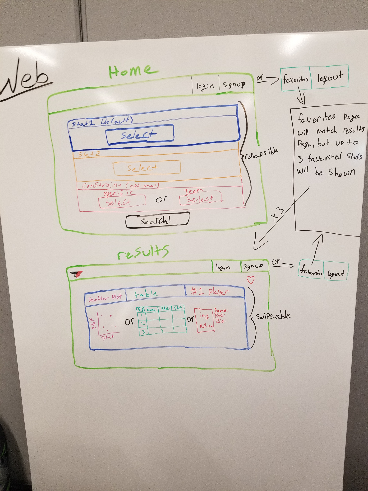

To get started, install the necessary npm packages
```shell
1. npm install
2. npm install knex
3. npm install express
4. npm install mocha
5. npm install body-parser
6. npm install knex-csv-seeder
```

Heroku link: https://compare-bb-stats.herokuapp.com/

Routes: https://drive.google.com/file/d/1tNVR4sqMlCXZqGdSlBajFwI5p0IB7_Hg/view?usp=sharing

Waffel.io: https://waffle.io/magin3191/q2-project

Schema: https://drive.google.com/file/d/1UpC2NWo5uZh6jaY9jzyNgf9bTl-0w-us/view?usp=sharing

* d3 designs:
  - Liquid Fill Gauge
  - Interactive Scatter Plot

* Materialize designs:
  - Collapsible/Popout
  - Dropdown
  - Feature Discovery(about section)
  - Tabs (Fixed Width/Swipeable)
  - Modals
  - Pushpin?
  - Waves?

* CSS Grid:
  - Yes

Fonts/sizes:

* H1:
  - Size: default
  - Title Font: Harbour


* H2:
  - Size: default
  - Name/characters font: Brothers


* H3:
  - Size: default
  - Result/tab/labels font: Klang

* P:
  - Size: default
  - Salon

* Colors: Muddy water
* Backgrounds: grey

* Margin: 20px,
* Padding: 15px

**Wire Frames:**

Mobile:


Web:


Login/Signup:

