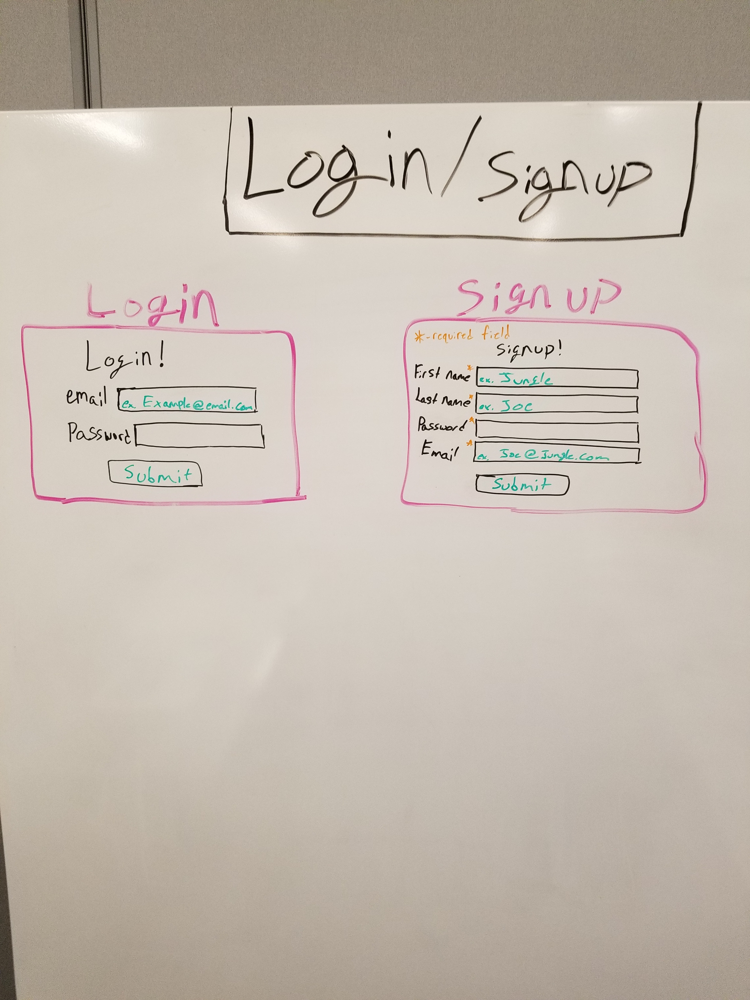

This app is designed to find correlations of NBA statistics using imported csv data.

Authors: Ross Tienken, Caelin Sheahan, Tim Jackson, Matt Agin.

1.To get started, run 'npm install' in the command line.

2.Next, create a database with 'createdb stats_db.'

3.To migrate the data, run 'knex migrate:latest.'

4.To seed the database, run 'knex seed:run.'

5.To run the app on the server, run 'npm start' or 'nodemon.'

* After making any changes to the migrations or seeds, be sure to drop the database with 'dropdb', and do all steps starting with step 2.

Heroku link: https://compare-bb-stats.herokuapp.com/

Routes: https://drive.google.com/file/d/1tNVR4sqMlCXZqGdSlBajFwI5p0IB7_Hg/view?usp=sharing

Waffel.io: https://waffle.io/magin3191/q2-project

Schema: https://drive.google.com/file/d/1UpC2NWo5uZh6jaY9jzyNgf9bTl-0w-us/view?usp=sharing

* d3 designs:
  - Liquid Fill Gauge
  - Interactive Scatter Plot

* Materialize designs:
  - Collapsible/Popout
  - Dropdown
  - Feature Discovery(about section)
  - Tabs (Fixed Width/Swipeable)
  - Modals
  - Pushpin?
  - Waves?

* CSS Grid:
  - Yes

Fonts/sizes:

* H1:
  - Size: default
  - Title Font: Harbour

H2:
  - Size: default
  - Name: characters
  - Font: NCAA Marquette Bold

* H3:
  - Size: default
  - Result/tab/labels font: Klang

* P:
  - Size: default
  - Salon

* Colors: Muddy water
* Backgrounds: grey

* Margin: 20px,
* Padding: 15px

**Wire Frames:**

Mobile:

Web:

Login/Signup:

